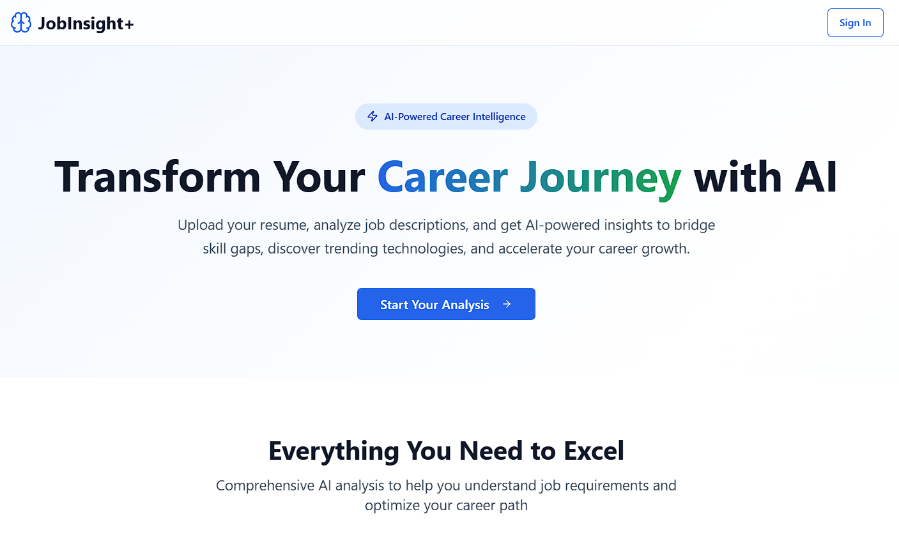

# 🚀 **JobInsight+** – *AI-Powered Career Intelligence Platform*

<p align="center">
  
</p>


**JobInsight+** is an AI-driven career assistant platform that helps job seekers analyze their resumes against job descriptions, identify skill gaps, and receive personalized recommendations for continuous growth.

---

## ✨ **Key Features**

### 📄 Smart Resume Analysis
- 🧠 Upload your resume (PDF/text) for instant analysis
- 🔍 Extract insights about your skills, experience, and education
- 🧭 Identify areas for growth and optimization

### 🧠 Job Matching Intelligence
- 🔗 Import job descriptions via URL or paste text directly
- 📊 Perform detailed skill gap analysis
- ✅ View a match percentage between your resume and the job role

### 📈 Career Trend Insights
- 🔍 Discover in-demand skills and technologies in your domain
- 🛰 Stay updated with real-time industry trends
- 📡 Get alerts about emerging tools and frameworks

### 🤖 AI-Powered Recommendations
- 🛣 Get personalized learning paths and certifications
- 🎯 Targeted suggestions to bridge specific skill gaps
- 🧩 Tailored resources based on your career path


---

## ⚙️ **Getting Started**

### ✅ Prerequisites
- [Node.js](https://nodejs.org/) (v16 or higher)
- `npm` or `yarn`
- A modern web browser

### 📦 Installation

```bash
# Clone the repository
git clone https://github.com/zeusgodyt/Insight-.git
cd jobinsight-plus

# Install dependencies
npm install   # or yarn install
